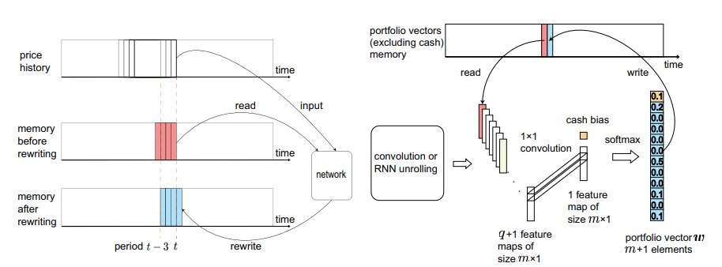
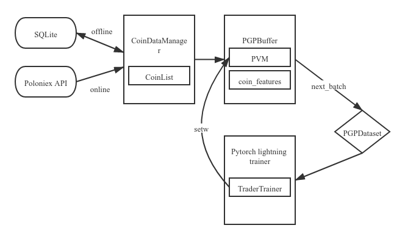
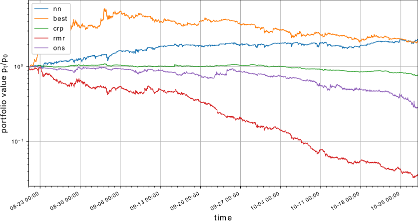

##  A Deep Reinforcement Learning Framework for the Financial Portfolio Management Problem

### Introduction

Link to project [Video](https://www.youtube.com/watch?v=TuBabSVXCZI&ab_channel=Iffi)

Link to project [Slides](https://docs.google.com/presentation/d/1WagL1_1kufbpzJYGrKOdwAA4oAjFO3FmcLfOpastRAQ/edit?usp=sharing)

Link to original [Implementation](https://github.com/ZhengyaoJiang/PGPortfolio)

### Overview

1. How to use the framework.
2. About the Poloniex dataset.
3. Method of the framework (algorithm overview).
4. Code implementation.
   1. Understanding framework structure.
   2. Understanding the framework dataflow.
   3. Understanding the trainer implementation.
5. Future improvements.

### Usage

#### Installation

Make sure your python version >= 3.7, create a virtual environment using:

```
virtualenv venv
chmod +x venv/bin/activate
venv/bin/activate
```

Then install requirements using:

```
pip install -r requirements.txt
```


#### Command line

Currently our implementation doesn't support parallel training, so you will have to manually train with each config file:

First download data to local cache, we have added support for socks5 proxy, so you can use it if your network condition to Poloniex is not good.

```
python main.py --mode download_data --working_dir test --proxy localhost:1082
```

Then train an nnagent, use 0,1,...,n to select your cuda device if you have gpu, default is running on cpu, `--offline` means using data just downloaded:

```
python main.py --mode train --working_dir test --device=0 --offline
```

After finish training you can do the following things:

In order to see detailed backtesting steps for each algorithm:

```
python main.py  --mode backtest --working_dir test --offline --algos nn,rmr
```

And output contains:

```
INFO:root:
                =============================================================
                Step 1:
                Raw weights:       1.34e-04:BTC,3.33e-03:ETH,1.31e-01:XMR,1.04e-02:reversed_USDT,2.16e-02:DASH,2.45e-02:LTC,1.72e-02:ETC,5.24e-02:XRP,1.96e-03:ZEC,6.20e-01:DCR,1.92e-02:XEM,9.76e-02:STR
                Total assets:      1.003 BTC
                Portfolio change:  1.00309
                
INFO:root:
                =============================================================
                Step 2:
                Raw weights:       1.38e-04:BTC,5.85e-03:ETH,1.52e-01:XMR,1.41e-02:reversed_USDT,1.94e-02:DASH,2.87e-02:LTC,2.40e-02:ETC,6.96e-02:XRP,1.72e-03:ZEC,6.13e-01:DCR,8.11e-03:XEM,6.29e-02:STR
                Total assets:      1.007 BTC
                Portfolio change:  1.00354
...
```


To get the backtest curve figure using selected algorithms:

```
python main.py  --mode plot --working_dir test --offline --algos nn,best,crp,rmr,ons
```

To get a complete summary table:

```
python main.py --mode table --working_dir test --offline --algos nn,best,crp,ubah,anticor,olmar,pamr,wmamr,cwmr,rmr,ons,up,eg,m0 --format=csv
```


#### Configuration File
Under the `nntrader/nntrader` directory, there is a json file called `net_config.json`,
 holding all the configuration of the agent and could be modified outside the program code.
##### Network Topology
* `"layers"`
    * layers list of the CNN, including the output layer
    * `"type"`
        * domain is `{"ConvLayer", "FullyLayer", "DropOut", "MaxPooling",
        "AveragePooling", "LocalResponseNormalization", "SingleMachineOutput",
        "LSTMSingleMachine", "RNNSingleMachine"}`
    * `"filter shape"`
        * shape of the filter (kernal) of the Convolution Layer
* `"input"`
    * `"window_size"`
        * number of columns of the input matrix
    * `"coin_number"`
        * number of rows of the input matrix
    * `"feature_number"`
        * number of features (just like RGB in computer vision)
        * domain is {1, 2, 3}
        * 1 means the feature is ["close"], last price of each period
        * 2 means the feature is ["close", "volume"]
        * 3 means the features are ["close", "high", "low"]

##### Market Data
* `"input "`
    * `"start_date"`
        * start date of the global data matrix
        * format is yyyy/MM/dd
    * `"end_date"`
        * start date of the global data matrix
        * format is yyyy/MM/dd
        * The performance could varied a lot in different time ranges.
    * `"volume_average_days"`
        * number of days of volume used to select the coins
    * `"test_portion"`
        * portion of backtest data, ranging from 0 to 1. The left is training data.
    * `"global_period"`
        * trading period and period of prices in input window.
        * should be a multiple of 300 (seconds)
    * `"coin_number"`
        * number of assets to be traded.
        * does not include cash (i.e. btc)

### Poloniex Dataset
Poloniex(founded in 2013) is a cryptocurrency exchange that allows for the buying or selling of digital assets, such as Bitcoin (BTC), Ethereum (ETH), TRON (TRX), and other altcoins.

Poloniex is no longer available for US users, margin trading was stopped in october 2018 with regards to US laws.

Steps to access and interact with the poloniex exchange are [here](https://docs.poloniex.com/#introduction).

### Method of the framework

We have already included all details in the slides, you can also refer to the [original paper](https://arxiv.org/pdf/1706.10059v2.pdf) for more details, here we will only talk about the most core things needed by this model.

#### Model assumptions

- **Zero slippage:** The liquidity of all market assets is high enough that, each trade can be carried out immediately at the last price when a order is placed.
- **Zero market impact**: The capital invested by the software trading agent is so insignificant that is has no influence on the market.

#### Metrics

- p: Total portfolio value scalar at time step t, initial value p0 is usually set to 1.
- v: Portfolio price vector, each element i contains the market closing price of portfolio i at time t.
- y: Portfolio price relative vector.
- u: Commission rate scalar. 
  - This scalar can be computed precisely using a recursive method.
  - Or estimated using a fixed commission ratio, details are left out here.

#### loss function

Default is loss function 6, which means:

```_
loss = mean(log(p_0 * product(u_t * y_t * w_{t-1}))
```

You can see all loss functions [here](https://github.com/iffiX/PGPortfolio-pytorch/blob/master/pgportfolio/nnagent/metrics.py)

#### Agent input / output:

In our default config (mainly because the output layer is "EIIE_Output_WithW" which ends with "WithW", meaning last portfolio weight vector is required.) The network takes in a 4 dimensional coin features of shape `[batch, feature, coin, time]`, and a last weight vector of shape `[batch, coin]`

```
net(features, last_w) -> new_w
```

The output is of shape `[batch, coin+1]`, with the default cash weight appended to the front. In this case the default cash is BTC.

#### Agent interaction with buffer

#### 

In each training step, the agent samples a batch which is continuous in time and train on it, then output new weights to update old weights in the portfolio vector memory(PVM).

### Code implementation

#### Framework structure

Bellow is a list of python files used in the framework, their functions are explained in brackets on the right side.

```
.
├── constants.py			(a list of constant values)
├── marketdata				(marketdata implements functions to get data from poloniex,
│	│   					 including downloading, cleaning, and converting to numpy)
│   ├── coin_data_manager.py    (implements cleaning and conversion)
│   ├── coin_list.py		    (implements functions to select coins with biggest volumes)
│   └── poloniex.py				(implements poloniex http API accessors)
├── nnagent					(nnagent implements things related to the nn agent)
│   ├── metrics.py				(all metrics used in training, including loss)
│   ├── network.py				(network auto constructor)
│   ├── replay_buffer.py		(combines PVM with coin features, like a pytorch dataset)
│   ├── rollingtrainer.py		(rollingtrainer for online trading, extends tradertrainer)
│   └── tradertrainer.py		(pytorch lightning module for agent training)
├── tdagent					(tdagent implements all traditional algorithms)
├── trade					(trade includes all trading tests, here only backtests)
│   └── backtest.py				(backtest implementation)
└── utils					(Various utility functions)
    ├── cache.py				(A cache for python class calculated attributes)
    ├── config.py				(config processor)
    ├── indicator.py			(indicator functions like APV, SR, MDD)
    ├── misc.py					(miscellaneous functions)
    └── plot.py					(plotting and result table generation)

```

#### Framework dataflow



The framework dataflow could be represented with the graph above, it took a lot of effort for us to clean up original code and rename variables to understandable names. 

##### Poloniex source

The bottom data source is Poloniex data API, which  pulls raw chart data for each coin and time period, a simple demonstration of the API implementation is below:

```
class Poloniex:
    """
    This class is designed to grab online data from https://poloniex.com/

    Currently only public commands are supported.
    Private commands not implemented.
    """
    def market_ticker(self):
        return self.api('returnTicker')

    def market_volume(self):
        return self.api('return24hVolume')

    def market_status(self):
        return self.api('returnCurrencies')

    def market_loans(self, coin):
        return self.api('returnLoanOrders', {'currency': coin})

    def market_orders(self, pair='all', depth=10):
        return self.api('returnOrderBook',
                        {'currencyPair': pair, 'depth': depth})
```

Class `CoinList` is used by class `CoinDataManager` as a sub component to determine coins to select when user gives the number of coins to trade in the `"input"` section of `config.json`:

```
"input":{
  "coin_number":11
 }
```

Then `CoinList` selects top 11 coins with the biggest volume using its `top_n_volume` method:

```
def top_n_volume(self, n=5, order=True, min_volume=0):
```

##### Local SQLIte cache

since it is quite expensive to download data from the beginning every time, our framework implements a SQL based cache to store all relevant information, and it also supports expanding to a longer period of time using previously downloaded data if coin number and feature number remain the same.

As a general rule of thumb, we call the method `get_coin_features` as a general way to get features as a 3 dimensional numpy array. In the future if any other data sources needed to added, they only have to provide the same data interface to merge into our architecture:

```
def get_coin_features(self, start, end, period=300, features=('close',))
```


Since it is kind of clumsy to construct `CoinDataManager` from config values by hand, we provide the helper function `coin_data_manager_init_helper` to help users initialize this class:

```
def coin_data_manager_init_helper(config, online=True, download=False, db_directory=None)
```

##### PGPBuffer

Class `PGPBuffer` implements all the details needed to same a batch of state (history observations, x and last weight vector, w), and the relative portfolio value vector (y), needed to train the agent. To initialize it, we also provide a helper function `buffer_init_helper` as:

```
def buffer_init_helper(config, device, online=True, db_directory=None)
```

Internally it registers to torch tensors `_pvm` and `_coin_features` as buffers so they can be moved with the module automatically, in order to create a sample, it first select a starting index using method `_sample_geometric`, which produce a random index according to the geometric distribution:

```
@staticmethod
    def _sample_geometric(start, end, bias):
        """
        Generate a index within [start, end) with geometric probability.

        Args:
            bias: A value in (0, 1).
        """
        ran = np.random.geometric(bias)
        while ran > end - start:
            ran = np.random.geometric(bias)
        result = end - ran
        return result
```

Finally it pack all samples and set it to the trainer with a callback function `setw`, which is used by the trainer module to update the portfolio vector memory:

```
    def _pack_samples(self, index):
        index = np.array(index)
        last_w = self._pvm[index - 1, :]

        def setw(w):
            assert t.is_tensor(w)
            self._pvm[index, :] = w.to(self._pvm.device).detach()

        batch = t.stack([
            self._coin_features[:, :, idx:idx + self._window_size + 1]
            for idx in index
        ])
        # features, [batch, feature, coin, time]
        X = batch[:, :, :, :-1]
        # price relative vector of the last period, [batch, norm_feature, coin]
        y = batch[:, :, :, -1] / batch[:, 0, None, :, -2]
        return {"X": X, "y": y, "last_w": last_w, "setw": setw}
```

Class `PGPDataset` is a general torch `IterableDataset`, so the pytorch lightning trainer could sample from it:

```
class PGPDataset(IterableDataset)
```

#### Trainer Implementation

Thanks to the power of the pytorch lightning, we can simplify our training procedure by just defining the following three methods of a `LightningModule`:

```
def __init__(self)
def training_step(self, batch, batch_index) -> t.tensor
def configure_optimizers(self)
```

This greatly improves the readability of our implementation, below is a simplification of our full implementation, but the gist is captured well:

```
class TraderTrainer(pl.LightningModule):
    def __init__(self, config, online=True, db_directory=None):
    	...
    def training_step(self, batch, _batch_idx):
        batch = batch[0]
        new_w = self._net(batch["X"], batch["last_w"])
        batch["setw"](new_w[:, 1:])
        return self._init_metrics()\
            .eval(batch["y"], batch["last_w"], new_w).loss
            
    def configure_optimizers(self):
        learning_rate = self._config["training"]["learning_rate"]
        decay_rate = self._config["training"]["decay_rate"]
        training_method = self._config["training"]["training_method"]

        optim_method = t.optim.Adam
        optim = optim_method([
            {"params": layer.parameters(),
             "weight_decay": layer_config.get("weight_decay") or 0}
            for layer, layer_config in
            zip(self._net.layers, self._config["layers"])
        ], lr=learning_rate)

        lr_sch = t.optim.lr_scheduler.ExponentialLR(optim, gamma=decay_rate)
        return {"optimizer": optim, "lr_scheduler": lr_sch}
```

Finally we just need to pass this `LightningModule` to the trainer, and completes the training, along with other objectives like saving checkpoints, testing, etc, in `main.py`

```
    if options.mode == "train":
        # delete old models
        shutil.rmtree(options.working_dir + "/model")
        config = load_config(options.config)
        save_config(config, options.working_dir + "/config.json")
        checkpoint_callback = ModelCheckpoint(
            dirpath=options.working_dir + "/model",
            filename="{epoch:02d}-{test_portfolio_value:.2f}",
            save_top_k=1,
            monitor="test_portfolio_value", mode="max",
            period=1, verbose=True
        )
        early_stopping = EarlyStopping(
            monitor="test_portfolio_value", mode="max"
        )
        t_logger = TensorBoardLogger(
            options.working_dir + "/log/tensorboard_log"
        )
        trainer = pl.Trainer(
            gpus=0 if options.device == "cpu" else options.device,
            callbacks=[checkpoint_callback, early_stopping],
            logger=[t_logger],
            limit_train_batches=1000,
            max_steps=config["training"]["steps"]
        )
        model = TraderTrainer(config,
                              online=not options.offline,
                              db_directory=options.working_dir + "/database")
        trainer.fit(model)
```

### Result

For more detailed report and complete table of metrics, please refer to [results](https://github.com/iffiX/PGPortfolio-pytorch/tree/master/results)

#### Backtest 1



#### Backtest 2


Backtest 3


### Future improvements

There are several important future improvements worth noting:

- Add hyperparameter auto-tuning.
- Support more data sources except cryptocurrencies listed on Poloniex.
- Add online rolling training function.

The first improvement is adding hyperparameter auto tuning functions, the original implementation of the paper uses complex hand-written parallel training based on tensorflow, with no heuristics on optimizing hyperparameters. We can use pytorch lightning to implements large-scale parallel training and connect with hyperparameter tuning libraries like  the [NNI](https://github.com/microsoft/nni).

The second improvement is adding more data sources except from Poloniex, as we have introduced in the dataflow part, as long as the data interface is compatible with `get_coin_features` they can be used in the framework.

The third improvement is adding rolling training function, our implementation has implemented the `RollingTrainer` class, but haven't finished the part in `main.py` to connect to Poloniex and learning on the live stream, we can also add functions to allow agents learn from expert experience, this is also an important extension to adapt our code to real trading environments. 